### ========= creating and reseting the application =============
1) to create : npx create-expo-app@latest
2) to reset the application: npm run reset-project
3) 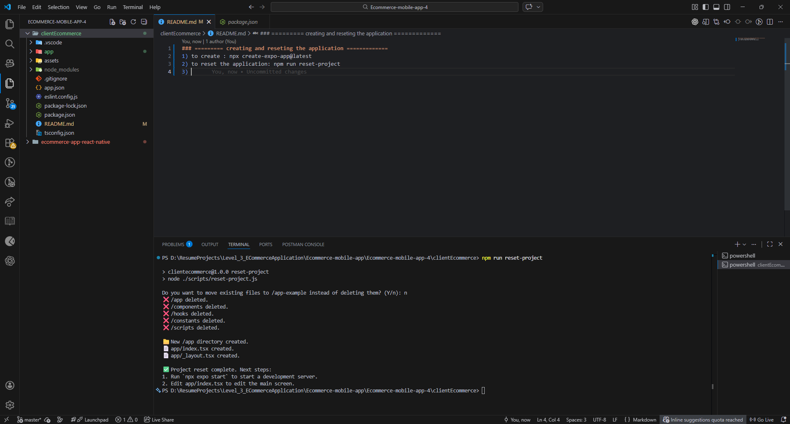
4) then start the project : npm run start 
5) 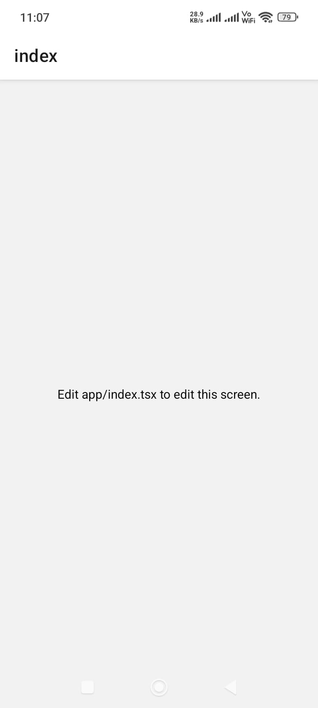
6) now we need to add the tailwings css for react native for that we need to use the nativewind: https://www.nativewind.dev/
7) 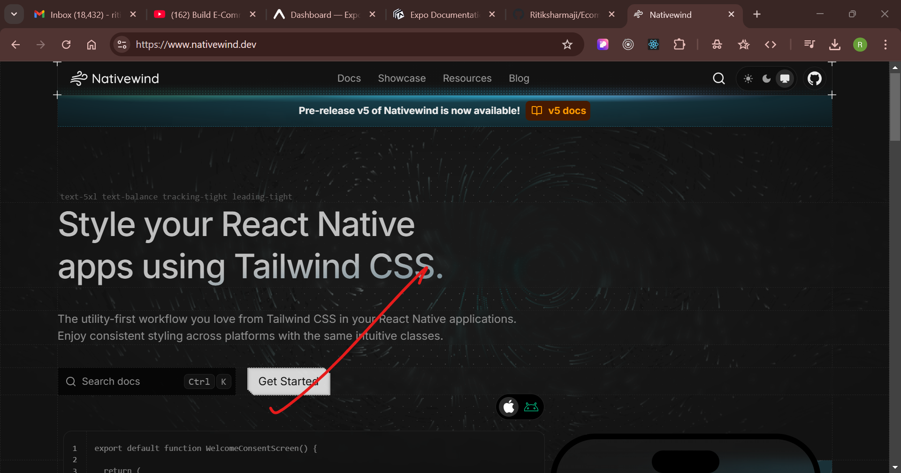
8) 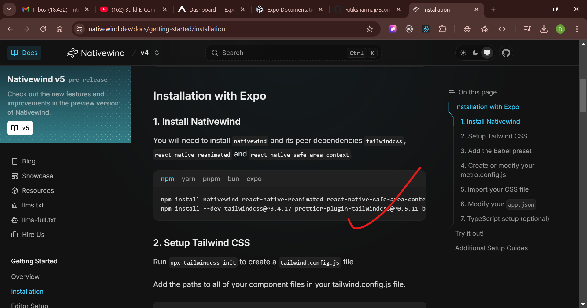
9) 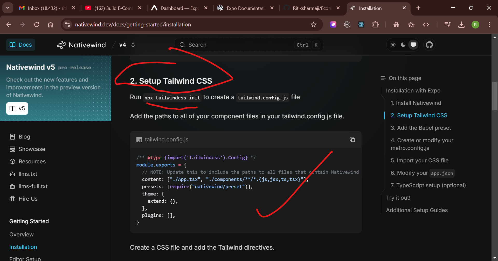
10) 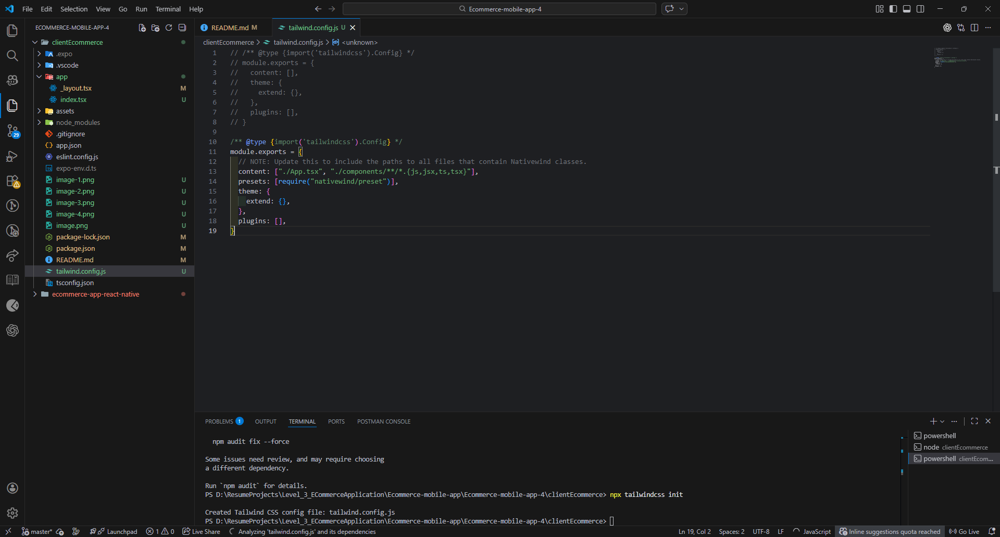
11) 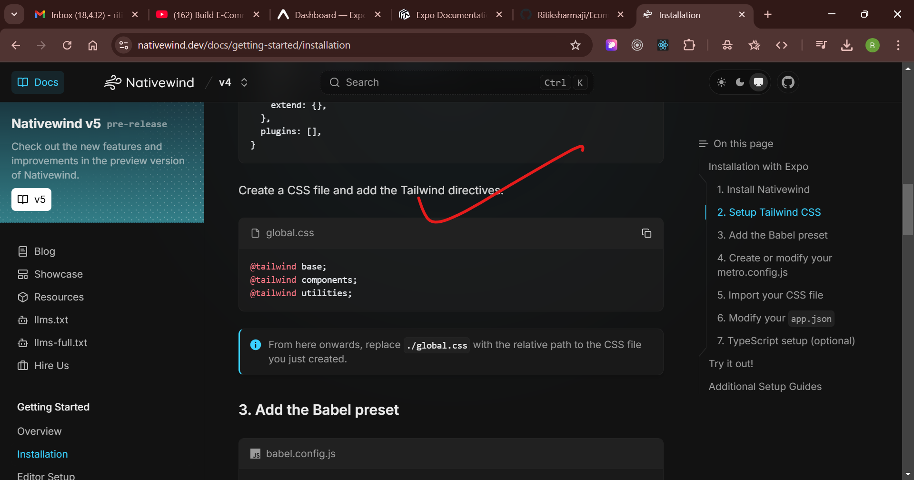
12) 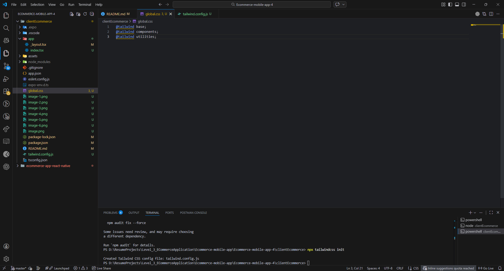
13) 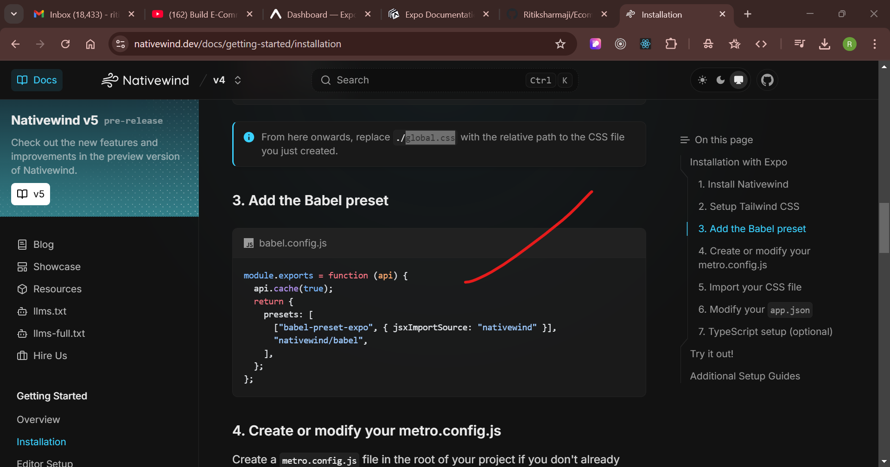
14) 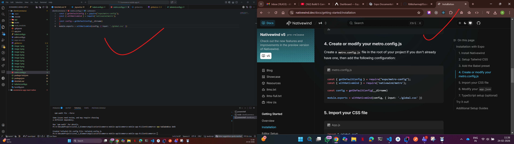
15) 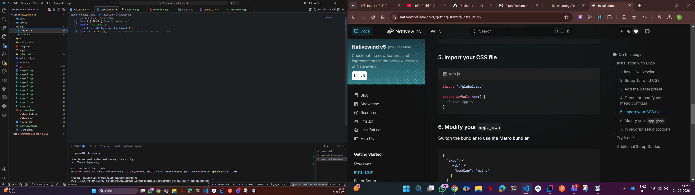
16) 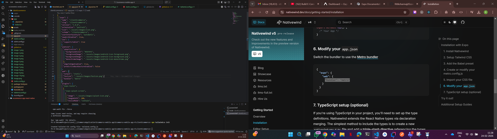
17) 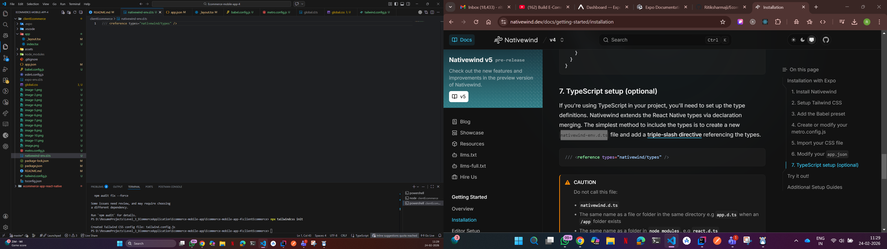
18) 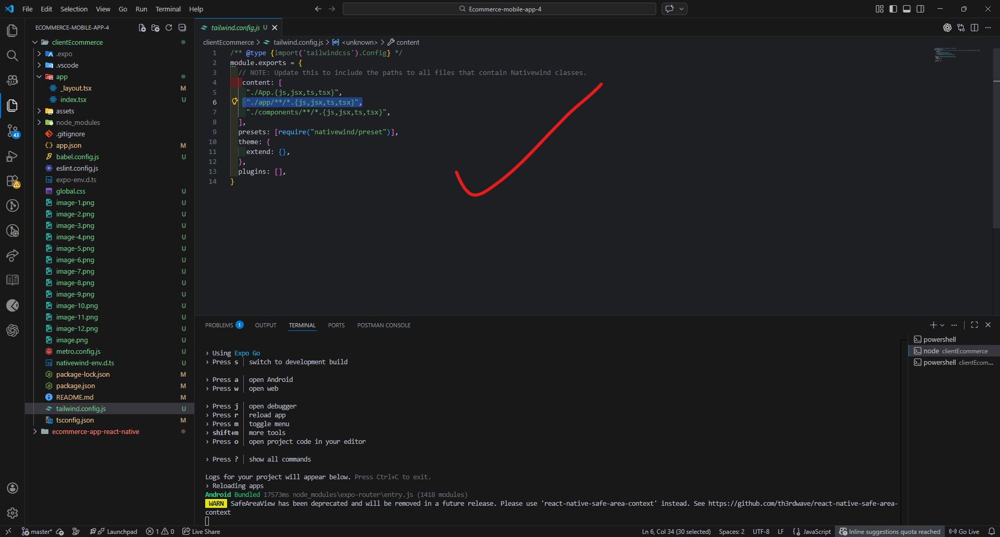
19) 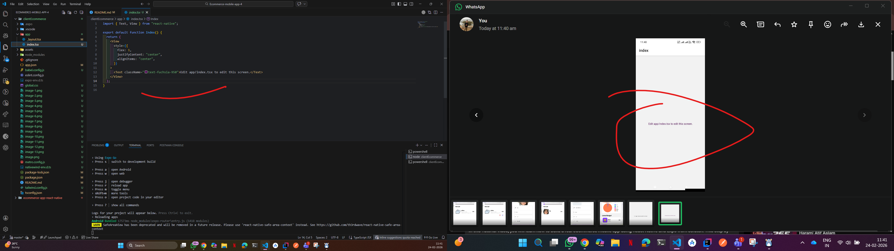

## ============ now setting the asstes and constants for the projects ===============
1) 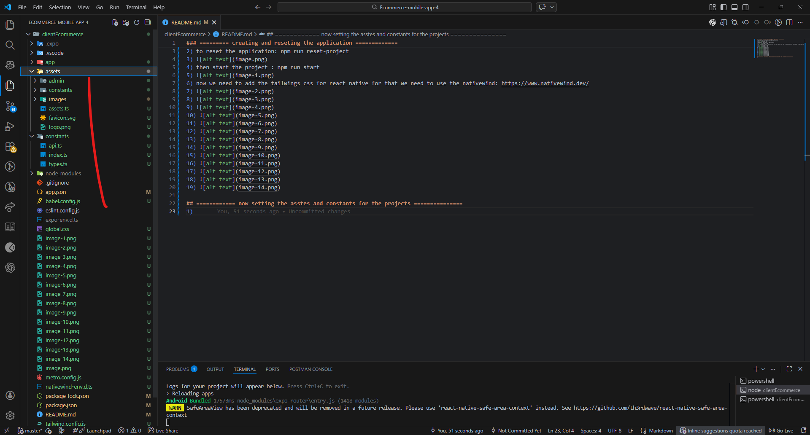

## =========== setting the screens tabls =================
1) 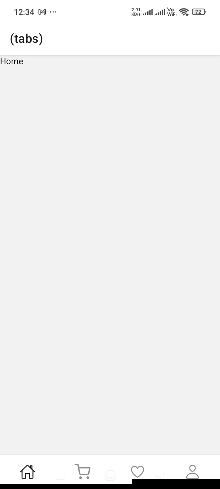
2) now pushed the code to githube

## ==================== coderevouuew =====
That’s completely fine 👍 — **you don’t need `.coderabbit.yaml` by default**, but without it, CodeRabbit uses **default settings**, which is why you’re seeing that message.

Let’s fix it properly 👇

---

# ✅ Why you’re seeing this

Since you don’t have a config file:

* **CodeRabbit** is using default rules
* Default = **only review PRs to main/master branch**

---

# 🚀 Best Solution → Create `.coderabbit.yaml`

Create a file in your repo root:

```
.coderabbit.yaml
```

---

## 🔥 Recommended Config (Use This)

```yaml
reviews:
  auto_review:
    enabled: true
    branches:
      - "*"

  review_status: false
```

---

# 📌 What this does

### ✅ `branches: "*"`

* Enables auto review on **ALL branches**
* Fixes your current issue permanently

### ✅ `review_status: false`

* Removes that annoying message

---

# 🛠️ Steps to Add It

1. Go to your repo
2. Click **Add File → Create new file**
3. Name it:

   ```
   .coderabbit.yaml
   ```
4. Paste the config
5. Commit

---

# ⚡ After Adding

* Push new PR → review happens automatically ✅
* No more “review skipped” message ✅

---

# 🔥 Alternative (No config file)

If you don’t want config:

Just comment in PR:

```
@coderabbitai review
```

---

# 💡 My Suggestion (Based on your goals)

Since you're aiming for **full-stack + production-level apps**, always:

* Use `.coderabbit.yaml`
* Enable auto reviews on all branches

👉 This simulates **real company workflows (very important for interviews)**

---

If you want next:
I can give you a **complete GitHub setup**:
✅ CodeRabbit + ESLint + Prettier + CI/CD
👉 so your projects look **industry-level** 🚀


## =============== creating product Details Screen ========
1) 
2) 
3) 
4) 

## ============ Create Shop Screen ===============
1) 
2) 
3) 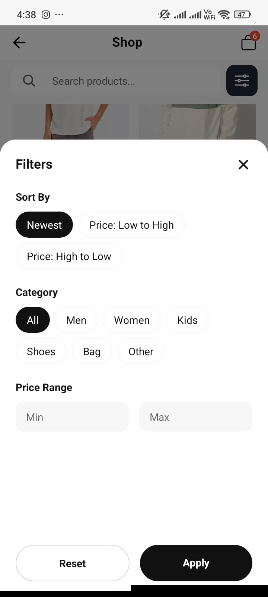
4) 
5) 

## ============ favorate screen =========
1) 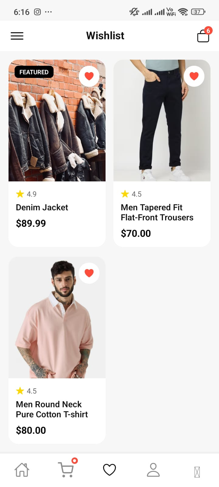

## ====== profile =======
1) 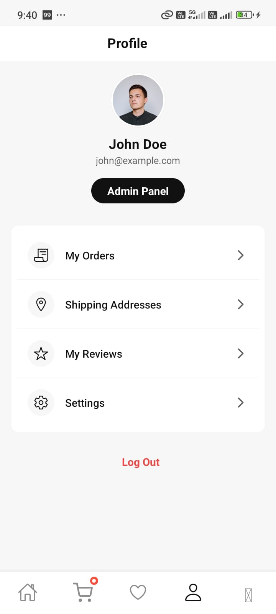

## ====== Error fixed =======
1) 
2) the forth tab comming 
Got it — your folder structure clearly shows the problem 👇

```
app
 └── (tabs)
      ├── shop/        ❗ THIS is the issue
      │    └── index.tsx
      ├── cart.tsx
      ├── favorites.tsx
      ├── index.tsx
      ├── profile.tsx
```

---

# 💥 WHY EXTRA TAB IS COMING

In **Expo Router**, **every file or folder inside `(tabs)` becomes a tab automatically**.

👉 So this:

```
shop/index.tsx
```

👉 is being treated as a **separate tab → "shop" tab**

That’s why:

* You see a **4th tab**
* Clicking it opens `shop/index.tsx`

---

# ✅ FIX (CHOOSE ONE)

## ✅ OPTION 1 (BEST PRACTICE)

Move `shop` **OUTSIDE `(tabs)`**

### ✔ Correct structure:

```
app
 ├── (tabs)
 │    ├── index.tsx
 │    ├── cart.tsx
 │    ├── favorites.tsx
 │    ├── profile.tsx
 │
 ├── shop/
 │    └── index.tsx
```

👉 Now:

* No extra tab
* You can still navigate:

```js
router.push('/shop')
```

---

## ✅ OPTION 2 (IF YOU WANT TO KEEP IT INSIDE)

Hide it manually in `(tabs)/_layout.tsx`

Add this:

```js
<Tabs.Screen
  name="shop"
  options={{
    href: null, // 🔥 hides from tab bar
  }}
/>
```

---

## ⚠️ WHY YOUR CURRENT BEHAVIOR HAPPENS

* `(tabs)` auto-registers routes
* Folder = tab
* `shop/index.tsx` = `/shop`
* So Expo creates:

  * Home tab
  * Cart tab
  * Favorites tab
  * Profile tab
  * ❌ Shop tab (extra)

---

# 🚀 RECOMMENDED APPROACH

👉 Use this structure:

* Tabs = only main navigation
* Other screens = outside tabs

This is how **real apps (Flipkart/Amazon)** are structured.

---

# ✅ FINAL ANSWER

✔ Extra tab = `shop` folder inside `(tabs)`
✔ Clicking opens shop screen = expected behavior
✔ Fix = move `shop` outside OR hide it

---

If you want next level:
I can help you build **proper navigation flow like:**

* Home → Shop → Product → Cart
* With animations + stack inside tabs

Just tell me 👍

=========== output ======
1) 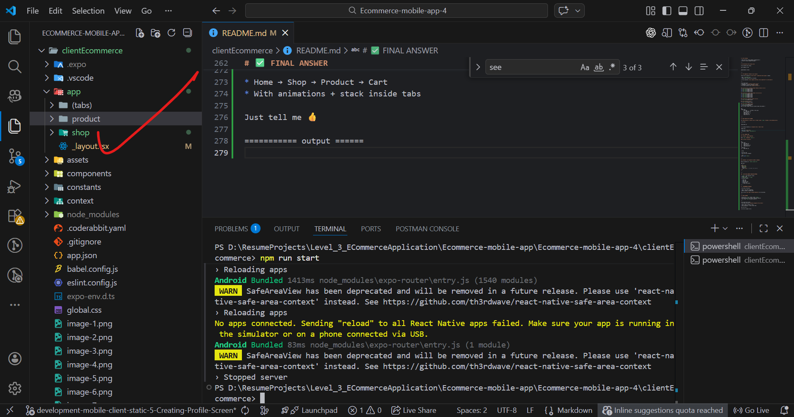
2) 

### =========== Add user authentication with Clerk =============
1) npm install @clerk/clerk-expo
2) 


## ============= working on admin panal ===============
1) npm i expo-image-picker
2) 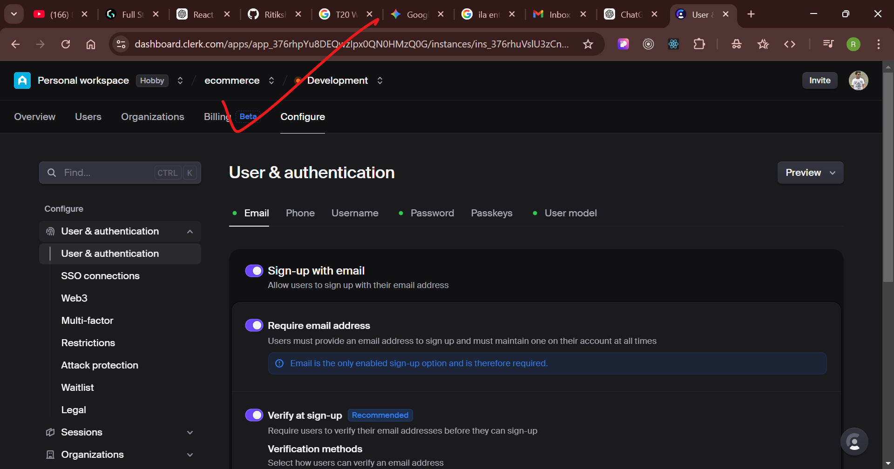
3) 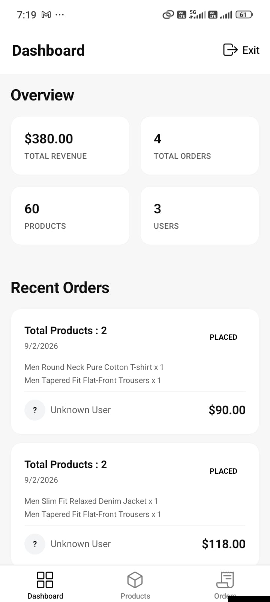
4) 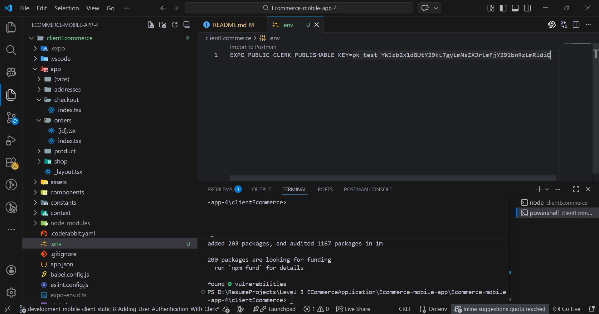
5) 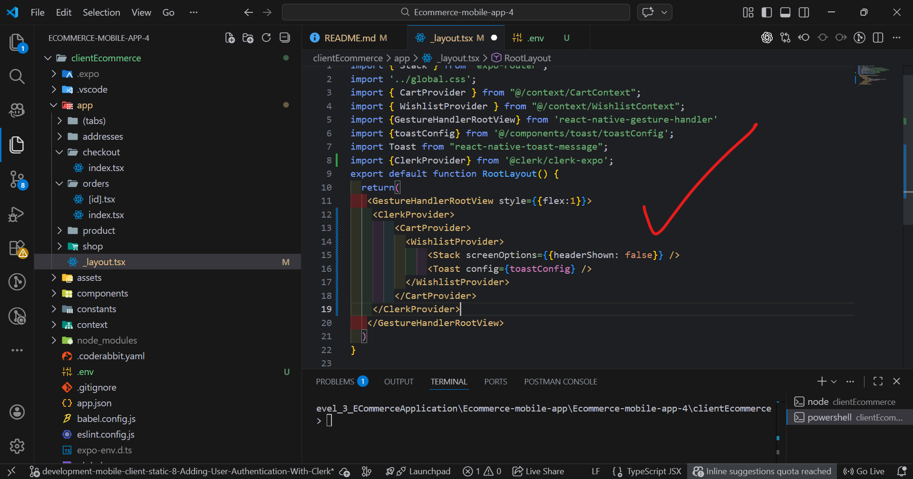
6) 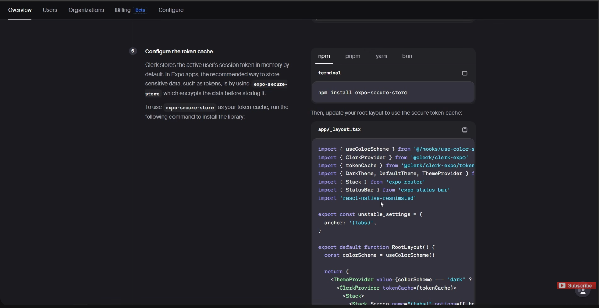
7) 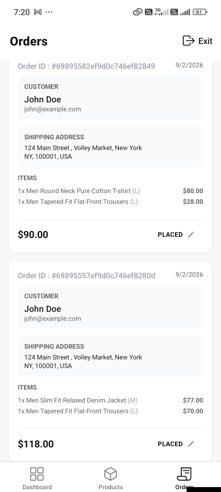
8) 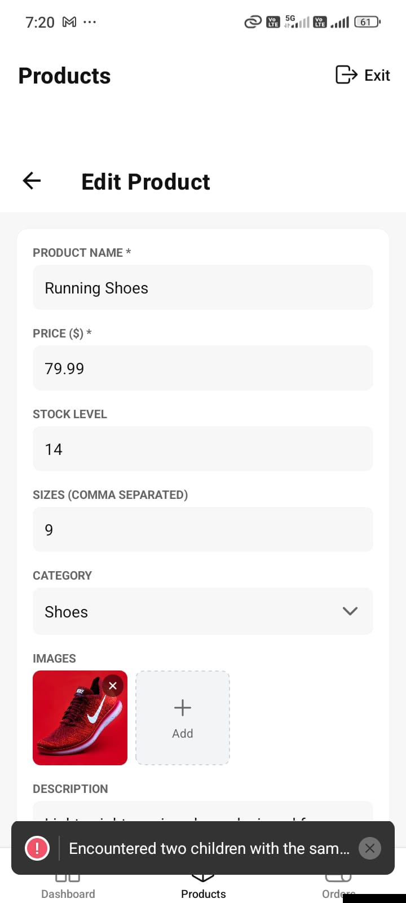
9) 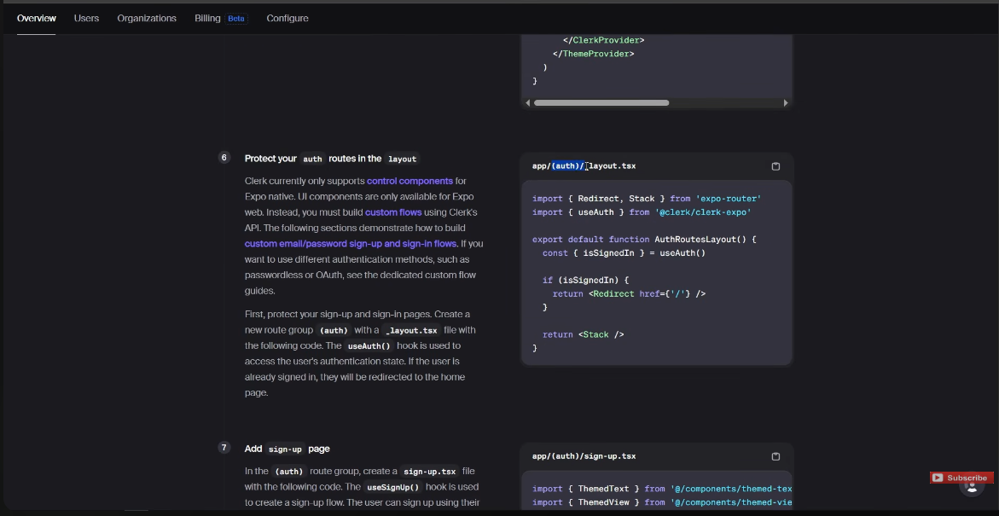
10) 
11) 